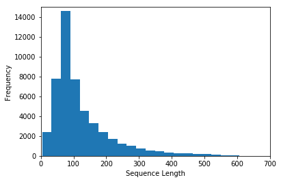
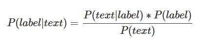
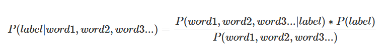
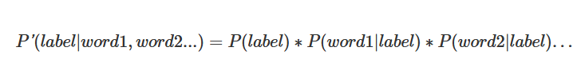
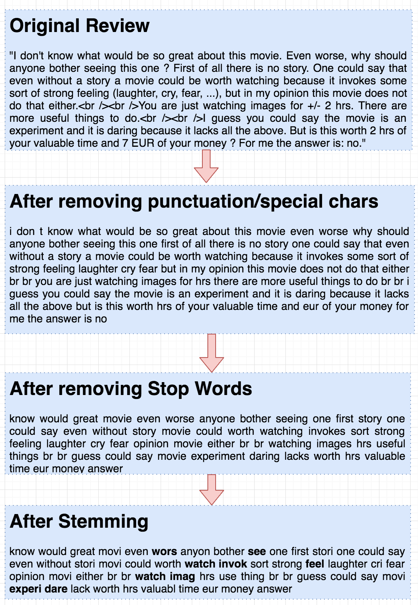

# Machine Learning Engineer Nanodegree
## Capstone Project
Siddheshwar Kumar  
April 28th, 2018

## I. Definition

### Project Overview
Sentiment analysis is one of the most interesting application of Natual Language Processing. It's used to figure out 
if a text, sentence or paragraph expresses negative, positive or neutral emotional feeling.

Social platforms like Twitter, Facebook etc have opinions expressed about different products and services. These opinions 
are trove of information for companies which want to improve their product, services, and marketing strategies. 
This is where sentiment analysis can help. It can tell in general what people think about your product i.e. they like it or dislike it. 

In the past, I have explored this topic a bit, but could not make much progress. I plan to use this opportunity to understand this 
interesting problem and apply deep learning to solve sentiment analysis on IMDB movie reviews. Other related datasets for performing sentiment analysis are 
Tweeter Feeds (https://www.kaggle.com/c/twitter-sentiment-analysis2), and rotten tomattos(https://www.kaggle.com/c/sentiment-analysis-on-movie-reviews).
 

### Problem Statement
The goal is to perform sentiment analysis on IMDB reviews. This dataset is from an 
old Kaggle competition, **Bag of Words Meets Bags of Popcorn (https://www.kaggle.com/c/word2vec-nlp-tutorial)**.

The trained model should be able to predict whether a movie review is negative or positive given only the text.

For this problem, I will apply Naive Bayes first to create a benchmark. Naive Bayes works quite well in text classifcation problems.
And, then plan to use the accuracy obtained in the Naive Bayes as a baseline and improve it further using Deep Learning Technique. 
Recurrent Neural Networks are often used to deal with texts; so I will be using RNN as the final approach. 

### Metrics
I have solved the this problem using a more traditional machine learning approach using Naive-Bayes for benchmarking purpose and then a more sophisticated Deep learning technique, Recurrent Neural Network.

For Naive Baiyes approach, I have used Compute Receiver operating characteristic (ROC) method. This method is suitable for the binary classification problem which 
is the case here. The ROC curve is a graphical plot that illustrates the performance of any binary classifier system as its discrimination threshold is varied.
To understand ROC curve, please refer this, link(https://www.quora.com/Whats-ROC-curve).

And for RNN technique, I have used *Sigmoid* activation function. RNN/LSTM networks are bit different than the normal feedforward
network. Only the last output gets considered, rest all gets discarded. Cost is calculated using Mean Squared Error and uses AdamOptimizer.

## II. Analysis

### Data Exploration
IMDB dataset contains 25,000 labeled training reviews, 50,000 unlabeled training reviews, and 25,000 testing reviews. Unlabeled training data and testing data doesn't have a sentiment or output field; only labeled training data has sentiment field. So, to solve the problem, I have used only labelled training data. This way the implementation can get trained as well as tested. 

The file *(labeledTrainData.tsv)* is tab-delimited and has a header row followed by 25,000 rows and contains three columns/fields:

['id', 'sentiment', 'review']

**Fields in the file are:**
- *id*: Unique identifier for each entry in the dataset; we don't need this field for modeling.
- *sentiment*: Contains binary values (1 and 0). 1 for positive and 0 for negative. This is the label of the model.
- *review*: a Detailed review of movies. This is the text or feature on which machine learning models will get trained.

I have used 20% of data for testing and will report the accuracy of the model on this randomly selected dataset. The remaining 80% will be used for training the model. 
Distribution is Dataset is balanced (i.e. both positive and negative are 50% each). 12,500 are positive reviews and equal number for negative reviews as well.

### Exploratory Visualization
One of the major aspect of neural networks are that they take inputs of fixed length. Reviews are not of fixed length, this means we can't directly feed them to the network.

So lets study the distribution of word count across the reviews and then decided upper limit on the number of words to be considered for each review. 

On the X-axis, it defines distribution of number of words.
And on Y-axis it captures how many reviews fall in that category.

_*From the chart, it's evident that most of the reviews fall under 250 words.*_ 
Also, please note that this chart was prepared after cleaning the reviews of punctuations, special chars, and stop words. 

### Algorithms and Techniques
For this text classification problem, I have used below two approaches:

#### Naive Bayes Classifier:
One particular feature of Naive Bayes is that, it’s a good algorithm for working with text classification. The relative simplicity of the algorithm and the independent features assumption of Naive Bayes make it a strong performer for classifying texts. 
The Naive Bayes classifier uses the **Bayes Theorem** to select the outcome with the highest probability. This classifier assumes the features(in this case- words) are independent and hence the word naive.

The Naive Bayes classifier for this problem says that the probability of the label (positive or negative) for the given review text is equal to the probability of the text given the label, times the probability a label occurs, everything divided by the probability that this text is found.

Text in our case is collection of words. So above equation can be expressed as:

We want to compare the probabilities of the labels and choose the one with higher probability. The denominator, i.e. the term P(word1, word2, word3…) is equal for everything, so we can ignore it. Also, as discussed above there is no dependence between words in the text (not possible always as few words mostly appear together but we can ignore such abberations); so equation can be re-written as:

P(label=positive) is the fraction of the training set that is a positive text;
P(word1|label=negative) is the number of times the word1 appears in a negative text divided by the number of times the word1 appears in every text.
I have used sklearn library for implementing Naive-Bayes.

#### Recurrent Neural Network/Long Short-Term Memory (RNN/LSTM):
*Recurrent Neural Network, is basically a neural network that can be used when data is treated as a sequence, where the particular order of the 
data-points matter. More importantly, this sequence can be of arbitrary length.*

They are networks with loops in them, allowing information to persist. A recurrent neural network can be thought of as multiple copies of the same network, each passing a message to a successor.
Consider what happens if we unroll the loop. 

Below is image from famous colah blog (http://colah.github.io/posts/2015-08-Understanding-LSTMs/).

Recursive neural network proved to be efficient in constructing sentence representations. The model has tree
structure, which is able to capture semantic of sentence. RNN suffer from vanishing gradients problem, and makes it difficult to learn long-distance correlation in sequence. LSTM is a type 
a type of RNN and now mostly the de-facto implementation of RNN. 

### Benchmark
Naive-Bayes approach discussed above acts as benchmark. The final approach should provided accuracy more than the benchmark value.

naive-bayes.ipynb gives the benchmark values as 85%. So the RNN/LSTM network should achieve more than 85% accuracy on test data.
 

## III. Methodology
_(approx. 3-5 pages)_

### Data Preprocessing
Text contain lot of noise or un-important content. In current problem as well, not all features will be equally important. I have used below techniques to preprocess the dataset. 

#### Remove special chars
Punctuation, numbers and special characters are not going to add any value in sentiment analysis, so will remove all such characters. Also, the data is generated from an online platform so it might have some HTML tags as well; will get rid of them as well. 

#### Remove stop words
Words like and, the, it etc known as *Stop Words* also don't carry any meaningful information so; will remove all stop words from the reviews. Plan to use Python's **NLTK** library to get list of English Stop words. 

#### Stemmerize 
Not all unique words are different. Take example of love and loves; both are same but if treated differently it will un-necessarily increase the vocab. 

 
 
### Implementation
The implementation can be divided into two major stages:
1. Pre-processing component which deals with loading dataset in the memory and performing different operations
2. Model Implementation (Naive Bayes and RNN/LSTM)

#### Pre-Processing Layer 
There are two implementations so, I have abstracted common operations in a separate python file, Imdb.py.
Some of the operations are:

clean_text(review): Takes a particular review and removes punctuation, numbers and special characters. Also convert all chars to lower case.
remove_stop_words(review): Takes a particular review and removes all stop words by using Python's NLTK library. It removes only English stop words as we are dealing with English text.
stemmerize(review): STEMMER helps to reduce the vocabulary size drastically by treating similar words like love, lovely, loves as same.

Apart from above it also provides some reusable methods. Methods in Imdb.py are documented properly.

#### Model Implementation
The project contains two notebooks files one for each approach. For the first benchmarking approach, I have used Naive Bayes and it's implemented 
using SKLearn library (check naive-bayes.ipynb).
For the final approach, I have used LSTM and have used Tensorflow for this. The implementation can be found in rnn-lstm.ipynb. 
It's a quite simple implementation with one Input layer, one LSTM layer and then final output layer.  

Here, we'll pass in words to an embedding layer. We need an embedding layer because we have tens of thousands of words, so we'll need a more efficient representation for our input data than one-hot encoded vectors. You should have seen this before from the word2vec lesson. You can actually train up an embedding with word2vec and use it here. But it's good enough to just have an embedding layer and let the network learn the embedding table on it's own.
From the embedding layer, the new representations will be passed to LSTM cells. These will add recurrent connections to the network so we can include information about the sequence of words in the data. Finally, the LSTM cells will go to a sigmoid output layer here. We're using the sigmoid because we're trying to predict if this text has positive or negative sentiment. The output layer will just be a single unit then, with a sigmoid activation function.
We don't care about the sigmoid outputs except for the very last one, we can ignore the rest. We'll calculate the cost from the output of the last step and the training label.

https://www.dataquest.io/blog/naive-bayes-tutorial/

### Refinement
Below are parameters which I tweaked to improve the performance:
dropout_rate: started with .8 and then increased it to .9 finally.
num_units: num_units, the number of units in the cell, called lstm_size in this code. Usually larger is better performance wise. Common values are 128, 256, 512, etc. 

## IV. Results
_(approx. 2-3 pages)_

### Model Evaluation and Validation
During model implementation, tested the performance by varying different hyperparameters:

- Removed all characters other than alphabets i.e. only [a-z]
- Removed all stop words and stemmerized to keep the vocab limited
- For word embedding; used embedding layer and let the network learn the appropriate representation of encoding of the 
  words on its own in the course of training.
- Reviews length are variable. Fixed the sequence length to 250 words. Reviews which are more than 250 words will have
  only last 250 words. And reviews which are less than 250 words will get padded with 0 in the beginning.
- Used 80% of data for modelling and 20% for testing the accuracy of the model.
- From the embedding layer, the new representations will be passed to LSTM cells. These will add recurrent 
  connections to the network so we can include information about the sequence of words in the data.
- Wrap that LSTM cell in a dropout layer to help prevent the network from overfitting.
- LSTM cells go to sigmoid output. 
- We don't care about the sigmoid outputs except for the very last one, we can ignore the rest.  

In this section, the final model and any supporting qualities should be evaluated in detail. It should be clear how the final model was derived and why this model was chosen. In addition, some type of analysis should be used to validate the robustness of this model and its solution, such as manipulating the input data or environment to see how the model’s solution is affected (this is called sensitivity analysis). Questions to ask yourself when writing this section:
- _Is the final model reasonable and aligning with solution expectations? Are the final parameters of the model appropriate?_
- _Has the final model been tested with various inputs to evaluate whether the model generalizes well to unseen data?_
- _Is the model robust enough for the problem? Do small perturbations (changes) in training data or the input space greatly affect the results?_
- _Can results found from the model be trusted?_

### Justification
RNN/LSTM models have proved efficient in natural language problems. LSTM cells help the network remember the inputs 
which are important. So certain words which can play major role in deciding if the sentiment is positive or negative will
get captured. 

I have implemented a quite basic LSTM network but, still it outperformed the benchmark model (through Naive-Bayes)
accuracy. 
In this section, your model’s final solution and its results should be compared to the benchmark you established earlier in the project using some type of statistical analysis. You should also justify whether these results and the solution are significant enough to have solved the problem posed in the project. Questions to ask yourself when writing this section:
- _Are the final results found stronger than the benchmark result reported earlier?_
- _Have you thoroughly analyzed and discussed the final solution?_
- _Is the final solution significant enough to have solved the problem?_

## V. Conclusion
_(approx. 1-2 pages)_

### Free-Form Visualization
In this section, you will need to provide some form of visualization that emphasizes an important quality about the project. It is much more free-form, but should reasonably support a significant result or characteristic about the problem that you want to discuss. Questions to ask yourself when writing this section:
- _Have you visualized a relevant or important quality about the problem, dataset, input data, or results?_
- _Is the visualization thoroughly analyzed and discussed?_
- _If a plot is provided, are the axes, title, and datum clearly defined?_

### Reflection
In this section, you will summarize the entire end-to-end problem solution and discuss one or two particular aspects of the project you found interesting or difficult. You are expected to reflect on the project as a whole to show that you have a firm understanding of the entire process employed in your work. Questions to ask yourself when writing this section:
- _Have you thoroughly summarized the entire process you used for this project?_
- _Were there any interesting aspects of the project?_
- _Were there any difficult aspects of the project?_
- _Does the final model and solution fit your expectations for the problem, and should it be used in a general setting to solve these types of problems?_

### Improvement
In the model, I let the network learn the word encoding. I think, using pre-trained models like Word2Vec can help 
improve the performance of the model. It will also, speed up the training time of the model. 

--
In this section, you will need to provide discussion as to how one aspect of the implementation you designed could be improved. As an example, consider ways your implementation can be made more general, and what would need to be modified. You do not need to make this improvement, but the potential solutions resulting from these changes are considered and compared/contrasted to your current solution. Questions to ask yourself when writing this section:
- _Are there further improvements that could be made on the algorithms or techniques you used in this project?_
- _Were there algorithms or techniques you researched that you did not know how to implement, but would consider using if you knew how?_
- _If you used your final solution as the new benchmark, do you think an even better solution exists?_

-----------

**Before submitting, ask yourself. . .**

- Does the project report you’ve written follow a well-organized structure similar to that of the project template?
- Is each section (particularly **Analysis** and **Methodology**) written in a clear, concise and specific fashion? Are there any ambiguous terms or phrases that need clarification?
- Would the intended audience of your project be able to understand your analysis, methods, and results?
- Have you properly proof-read your project report to assure there are minimal grammatical and spelling mistakes?
- Are all the resources used for this project correctly cited and referenced?
- Is the code that implements your solution easily readable and properly commented?
- Does the code execute without error and produce results similar to those reported?

https://www.toptal.com/machine-learning/nlp-tutorial-text-classification?utm_campaign=Toptal%20Engineering%20Blog&utm_source=hs_email&utm_medium=email&utm_content=62089346&_hsenc=p2ANqtz-941LZf4kwQwihG9HKVyl-PmdvELSXfqC0rryV8kAEnfc97gE1tvqwUzxWmfoEsm2-m6aPW6eoWwoeENdHNlR00L-OCtg&_hsmi=62089346
https://www.oreilly.com/learning/perform-sentiment-analysis-with-lstms-using-tensorflow